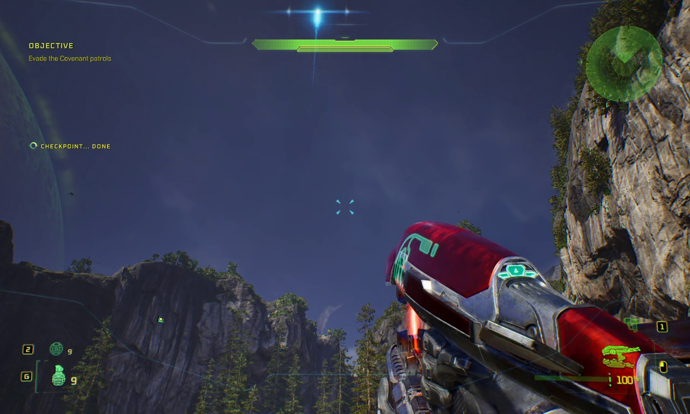
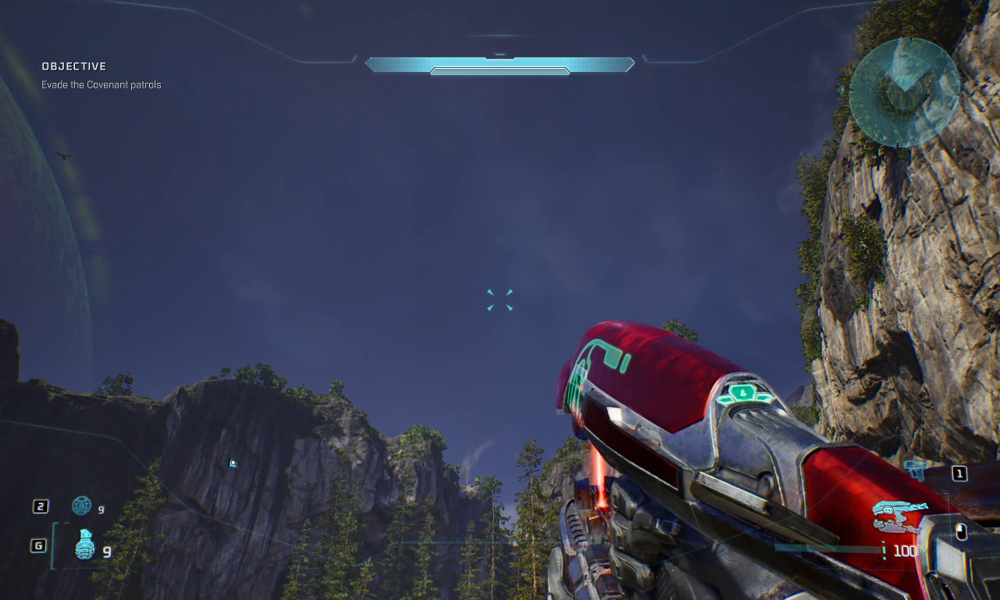
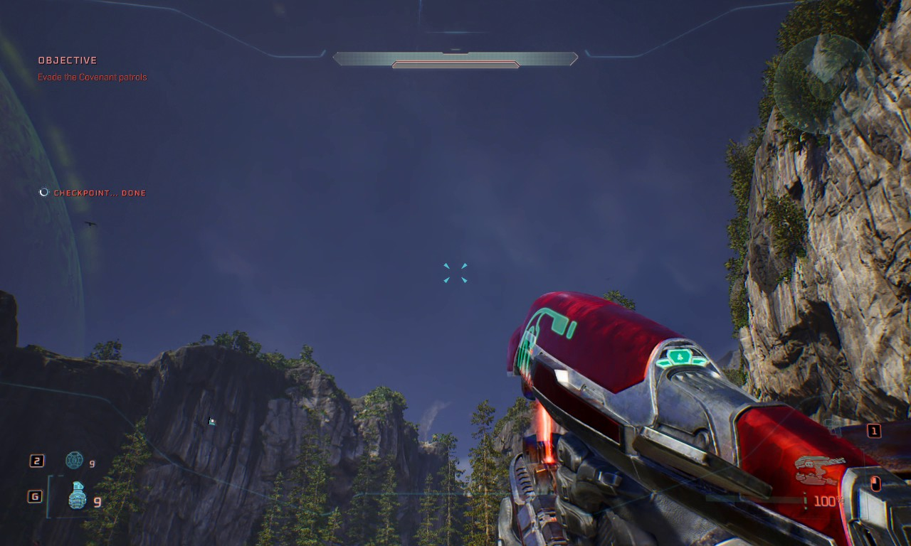

# CE HUD Color

Recolour the HUD in *Halo: Campaign Evolved*. Shields, ammo cradle, grenades,
equipment, radar and reticle, live in game, no asset edits and no restart.



*The `green` preset — which lands lime/yellow-green once it multiplies over the
stock HUD, not the flat green the name suggests. One key, every element: shield
bar, radar, objectives, the checkpoint banner, grenades and the ammo cradle.*

| Stock | Red |
|---|---|
|  |  |

Red shows the one thing worth knowing up front: the tint is a **multiply** over
a HUD that is already pale cyan, so a saturated colour lands *dark* until you
raise `intensity`.

---

## Install

1. Copy the `CEHudColor` folder into
   `<game>\Meteorite\Binaries\Win64\ue4ss\Mods\`.
2. Add a line to `ue4ss\Mods\mods.txt`:

   ```
   CEHudColor : 1
   ```

## Hotkeys

| Default | Action |
|---|---|
| `Ctrl+Shift+J` / `Ctrl+Shift+U` | next / previous colour preset |
| `Ctrl+Shift+O` / `Ctrl+Shift+I` | brighter / dimmer |
| `Ctrl+Shift+M` | tint on/off (off restores the stock colours) |
| `Ctrl+Shift+G` | report every HUD widget found, matched and unmatched |
| `Ctrl+Shift+R` | re-read `settings.ini` without restarting |

All seven are rebindable in `settings.ini` as `MODIFIER+MODIFIER+KEY`, e.g.
`key_next=ALT+P`. Leave a value empty to unbind it. UE4SS binds at load, so a
change needs a restart. Everything you change with a hotkey saves itself.

## Settings

| Key | What it does |
|---|---|
| `mode` | `multiply` (default) or `oklch` — see below |
| `color` | preset name, or a literal `r,g,b` of linear floats |
| `intensity` | multiplier, `0.2`–`4.0` |
| `targets` | which HUD elements to tint, comma separated substrings |
| `tint_reticle` | crosshair on its own switch |
| `tint_text` | recolour the ammo counter text |
| `enabled` | master on/off |

Presets: `stock` `green` `cyan` `blue` `yellow` `amber` `orange` `red` `pink`
`purple` `white`.

Preset names describe the *tint*, not always the result: because it multiplies
over a pale-cyan HUD, `green` reads as lime/yellow-green and `blue` barely
shifts at all. `yellow` is the truer yellow if that is what you are after.

### `mode=oklch` — pick the colour instead of tinting it

The engine gives exactly one lever: `ColorAndOpacity`, a per-channel multiply.
Multiply can only ever *remove* light, which is why a saturated colour lands
dark and why `intensity` exists at all.

But a multiply is invertible for a known source colour: to land a base **S** on
a target **T**, use **M = T / S**. So `mode=oklch` picks the target properly —
in OkLab, where lightness is perceptual and independent of hue — and solves for
the multiplier that reaches it:

```ini
mode=oklch
hue=0.0          # degrees: 0 red, 90 yellow-green, 180 cyan, 270 violet
chroma=0.150     # 0 is greyscale; 0.10-0.20 reads as a natural HUD
lightness=1.00   # multiplier on the HUD's OWN perceived lightness
```

Every hue then comes out at the *same* perceived lightness, and channels that
need to exceed 1.0 do so on their own — red solves to a multiplier of about
`2.09, 0.63, 0.93` with no hand-tuning. In this mode `Ctrl+Shift+J`/`U` rotate
the hue 15° at a time and `O`/`I` move `lightness`, so the keys keep working
without a second set to remember.

Two honest caveats:

* **The HUD is nearly white**, measured at `0.889, 0.990, 1.000`. That is why
  there is no "rotate the hue by N degrees" option — near-white has almost no
  chroma to rotate, so it would be a no-op. The target is built from hue and
  chroma directly instead.
* **One multiplier covers a whole widget subtree**, so the solve is exact only
  for pixels actually drawn in the base colour. That is nearly all of the HUD,
  but a radar contact blip or a damage flash is not the base colour and will
  not land on the target hue. That is the engine's single lever, not the maths.

`base_color` is what the solve works from. It is measured off a clean capture
and should not need changing unless your setup renders the HUD differently.

### The tint is a multiply, not a repaint

`ColorAndOpacity` multiplies into what the widget draws. The stock HUD is
already a pale cyan, so a saturated colour lands *dark* — there is little red in
the source pixels for a red tint to keep. That is what `intensity` is for:
values above 1.0 are legal in a linear colour and push the result back up.
Expect to want `1.5`–`2.5` for red, orange and purple; green and cyan are close
to the source and need little or none.

### Per-element colours

Any name in `targets` can take its own colour, its own intensity, or both:

```ini
color_motiontracker=red
intensity_motiontracker=2.00
color_shieldhealthbar=0.900,0.200,0.400
color_reticle=amber
```

Anything without an override follows the global `color`/`intensity` — and keeps
following the hotkeys, so you can still cycle the HUD while a pinned element
stays where you put it. Intensity is separately overridable because the tint is
a multiply and elements do not all start from the same base brightness: the
radar usually needs more push than the shield bar to reach the same colour.

An override that does not parse falls back to the global colour rather than to
black, so a typo reads as "that did not take" instead of an element vanishing.

`Ctrl+Shift+R` re-reads the file live — `targets` and the overrides have no
hotkeys of their own, and without it every tweak would cost a game restart *and*
a reload of the level to see the HUD again. Keybinds and `tint_text` are the
exceptions: UE4SS registers binds and hooks once at load, so those still need a
restart.

### The radar costs you the blip colours

The contact blips are children of the motion tracker, so tinting it recolours
them too and the red-versus-yellow distinction goes with them. It is in the
default `targets` anyway because an untinted radar looks half-finished — drop
`motiontracker` from the list if you would rather keep the blips.

## Playing with other HUD mods

The element tint is independent — it sets a property nothing else writes. The
one place mods can collide is the **ammo counter text**, which the game repaints
on every ammo change and which HUD mods therefore tend to drive through a hook
on `TextBlock:SetColorAndOpacity`. Hooks run in registration order, so whichever
mod loads **last** wins. If your ammo counters keep another mod's colour, move
`CEHudColor` below it in `mods.txt`. Nothing breaks either way.

This mod never writes the text's **alpha**, only its RGB — a magazine number
another mod is hiding with alpha 0 stays hidden.

## If an element will not change colour

Press `Ctrl+Shift+G` and read `UE4SS.log`. It prints what was matched and what
was not:

* **not matched** → add its name to `targets`;
* **matched but unchanged** → that element's material does not sample the Slate
  vertex colour, and no runtime tint can reach it. That needs an asset edit.

## Releases

Push a `v*` tag and the workflow at `.github/workflows/release.yml` runs the
builds `CEHudColor-<version>.zip` and publishes it. The tag has to
match `MOD_VERSION` in `Scripts/main.lua` or the build fails deliberately — a
release whose in-game banner reports a different version than its tag is the
kind of thing that costs an afternoon later.

The zip contains the `CEHudColor/` folder ready to drop into `ue4ss/Mods/`,
with `settings.ini`, this README and the LICENSE. Screenshots are left out to
keep the download small, so the image links above only resolve on GitHub.
